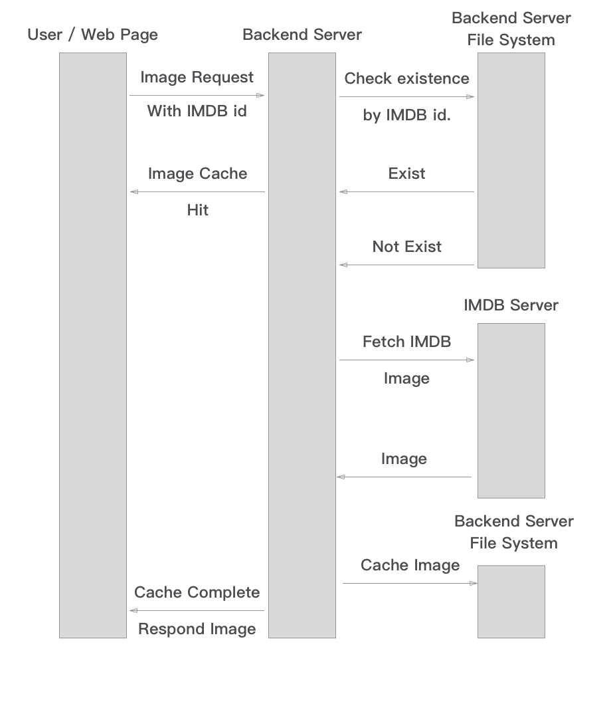

# Movie-Recommendation-System

## Overall
In generally, this application allow us to create a filter to help user to find some expected movie, based on their requirements. We use another database to store user’s search history. And the application will give some recommended movies to a specific user, based on their search history and some statistical measurement among movies. In specific, the application allows registered user to do following things:
Make fine-grained search about movies.
- Find an introduction to a specific movie and the rating about the movie
- Get general recommended movies based on a specific selected movie.
- Acquire the recommendations based on their searching history.

Service for registered users is the core of our application. For long-term users, we record each of their search history. 
For unregistered user, they are also able to:
- Make fine-grained search about movies.
- Find an introduction to a specific movie and the rating about the movie
- Get general recommended movies based on a specific selected movie.

## Technical Framework

## Achievement

#### Solving functional dependency problem when joining to rating table  
We have our ratings table including the following attributes: UserID, MID, Rating, Timestamp, in which the combination of UserID and MID is set to be the primary key.  
In this way, the MID may have connected to multiple rating values, if we are going to join the movies, genres, and ratings, we may not be able to using the group by operation.  
Thus, We created a view for the ratings, and calculate the average rating of each movie, then, we may be able to operate the data.

#### Web crawler and Caching mechanism
Except the basic information of a movie we have stored in our database, there are still some additional details we need for introducing a movie, such as the name of directors, the poster of it, the actors in the movie and some brief introductions. It will cost us some time to fetch these information from other websites. In other to acquire these informations, we have to do these things:
- First of all, we need to find the correspond IMDB id for this movie, and use web crawler to fetch all that we need. Since the crawling process takes 10s in each run, we have to make caches to make more efficiency.
- While the backend obtained the information, return these to the frontend which render these texts to the specific position, and make caches.

